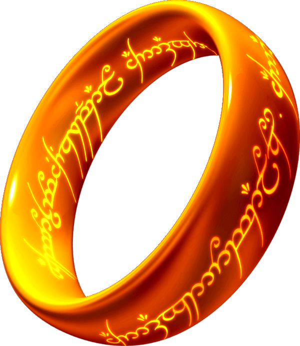

<h1 align="center">
    
    <a href="https://paulomvrech.github.io/memory-game-lotr/" target="_blank">Jogo da Memória - LOTR</a>
      
</h1>

## 💻 Sobre o projeto

Projeto desenvolvido para estudo de CSS e JS. O projeto é um jogo da memória, com o tema de O Senhor dos Anéis(LOTR)

Nele foi possível aplicar, entre várias outras funcionalidades, a utilização do localStorage do navegador, adcionando e consultando valores armazenados.

---

## 👀 Demo

<div align="center">
    
</div>

---

## 🚀 Tecnologias utilizadas

Esse projeto foi desenvolvido utilizando as seguintes tecnologias:

- HTML5
- CSS3
- Javascript

---

## 🛠 Como executar o projeto em sua máquina

```bash

# Clone este repositório
$ git clone https://github.com/paulomvrech/memory-game-lotr.git

# Acesse a pasta do projeto no seu terminal/cmd
$ cd memory-game-lotr

# Execute o arquivo index.html em seu navegador


```

---

<p align="center">Desenvolvido por 👏 Paulo Muller Vrech</p>
